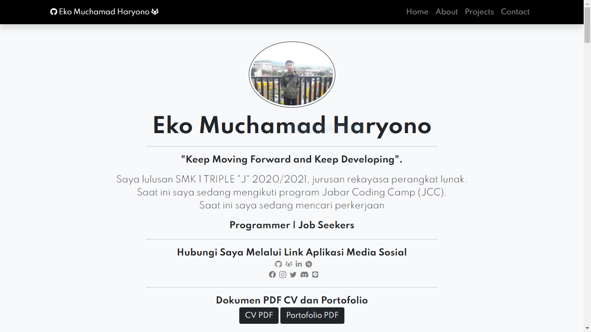
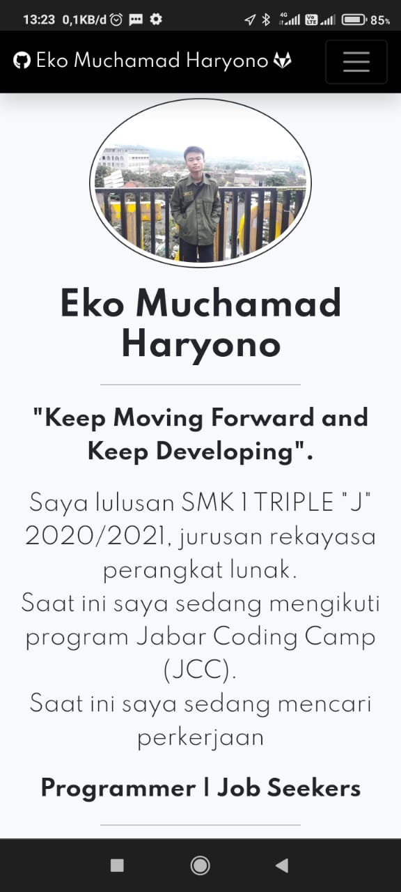

## Web Portofolio Saya

<h3>Web Mobile :</h3>

## Alat Yang Digunakan Untuk Membuat Web :

A. Hardware :
Laptop Aspire E1-472G. Speaksifikasi :

- Ram : 4GB DD3 L Memory
- Prosesor : Intel Core i5-4200U 1.6 GHz with Turbo Boost up to 2.5 GHz
- Tipe System : 64 bit
- VGA : NVIDIA GEFORCE GT 720M with 2GB Dedicated VRAM
- SSD : 128 GB

B. Software :

- Visual Studio Code
- Git

C. Komponen

- Bootstrap 5
- AOS (Animate On Scroll Library)
-
